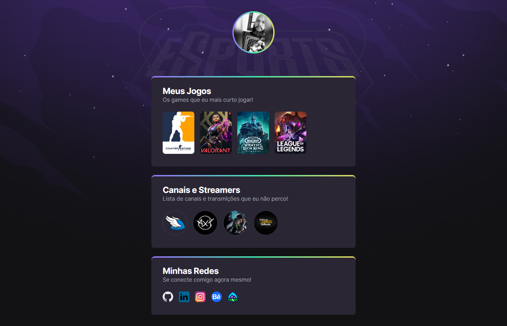

# NLW eSports

>Trilha Explorer

Projeto construído do eventro Next Level Week da Rocketseat

[Clique aqui para acessar](https://rodrigolourdes.github.io/nlw-trilhaexplorer-esports22/)

👨🏿‍💻 ## Tecnologias

- HTML
- CSS
- GIT e Github

💚 ## Contato

[Clique aqui para acessar](https://www.linkedin.com/in/rodrigodelourdes/)

DIA 01 - 11/09/22 - Stage 1/6 | Start

DIA 02 - 12/09/22 - Stage 2/6 | Base Building

Chegou o momento de acelerar na direção dos seus objetivos, levar suas habilidades e código para o próximo nível. Nessa aula vamos preparar o nosso ambiente e construir as bases pra dar início ao nosso projeto: o Game hub, um site centralizador de links, no estilo Linktree, feito especialmente para gamers. 

DIA 03 - 13/09/22 - Stage 3/6 | Final Round

DIA 04 - 14/09/22 - Stage 4/6 | Final Round

DIA 05 - 15/09/22 - Stage 5/6 | Final Round
Chegamos na reta final! Nessa aula vamos colocar o nosso projeto no mundo e disponibilizar na internet. #NextLevelWeek #NeverStopLearnin

DIA 06 - 18/09/22 - Stage 6/6 | The Next Level
